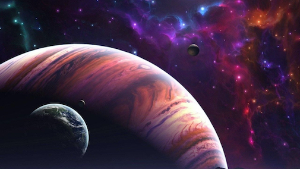

<h1 align="center"> 🚀 Cosmic Data Adventure: Exploring the Universe with Python 🚀 </h1>  

  

Welcome to my cosmic data adventure, where I document my journey through the universe of data analysis and visualization using Python! Join me as I explore the wonders of astronomical data and unlock the secrets of the night sky.

## Modules

1. **Tabular Data Visualization**: Analyze star color data and create compelling visualizations like line plots and Hertzsprung-Russell diagrams.

2. **Image Data Visualization**: Explore astronomical image data using Python. Learn about FITS files and enhance your ability to interpret celestial images.

3. **Image Processing | Apply Filters and Extracting Features**: Delve deeper into image processing techniques, crucial for identifying and extracting features from astronomical images.

## Technologies Used

This adventure is powered by the magic of Python and its trusty companions: pandas, seaborn, and matplotlib. Python helps with wrangling data, pandas brings it to life, seaborn provides statistical data visualizations, and matplotlib paints the picture. Together, we'll wield these tools to slice through the data, creating visualizations that illuminate our path!

## Join the Adventure

Download the dataset and the Jupyter Notebook from this repository and start your own data adventure! Join me in unravelling the mysteries of astronomical data and emerge victorious with newfound knowledge!

## Contributions Welcome

Your contributions and insights are invaluable! Simply, fork the repository, embark on your own analysis quests, and share your discoveries with the community through pull requests! Together, let's make this adventure even more epic!

## Contact

Have questions, feedback, or simply want to share your own data adventures? Reach out to me:

Sylvia Otieno - [Github](https://github.com/sotieno) / [Twitter](https://twitter.com/sotienos)

Thank you for joining me on this thrilling cosmic data adventure! Let's continue exploring the wonders of the universe together! 🚀🔍
